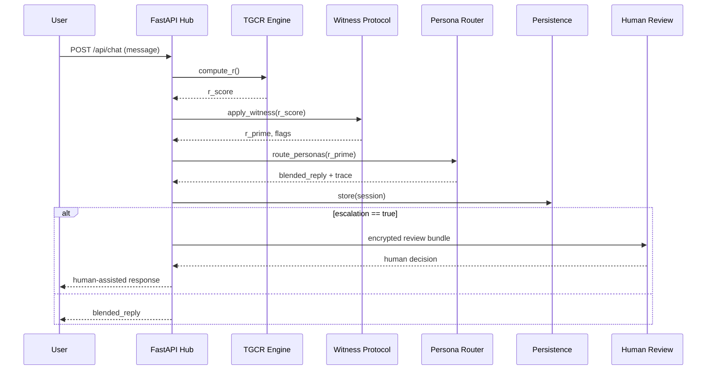

# 🏛️ LuminAI Genesis — System Architecture

LuminAI Genesis is an AI-safety-first conversational engine that replaces avoidance-based safety with presence-based safety. The backbone is TGCR (Theory of General Contextual Resonance) plus the Witness Protocol (W).

---

# 1. High-Level Diagram

```mermaid
graph LR
  UI[Next.js Client] --> API[FastAPI Hub]
  CLI[Typer CLI] --> API

  API --> Resonance[Resonance Engine (TGCR)]
  API --> Governance[Witness Protocol]
  API --> Personas[Persona Router]

  Personas --> API
  API --> DB[(Postgres / Redis / S3)]
  API --> Telemetry[Audit Logs]

  Telemetry --> Human[Human Reviewer]

  CI[GitHub Actions] --> API
```

---

# 2. Architecture Components

## FastAPI Hub (`/api/chat`)

- Stateless API endpoint
- Stores session state in database
- Applies TGCR scoring and Witness Protocol
- Routes output to multipersona blend

## Resonance Engine (TGCR)

- Computes contextual coherence:

```
R = ∇Φ^E · (φ^t × ψ^r)
```

- Outputs volatility, drift, and resonance score

## Witness Protocol

```
R' = R × W
```

Where W = Witness Coefficient (0 -> abandonment, 1 -> presence). System bias is toward W -> 1 unless a real safety breach occurs.

## Persona Router

- Blends LuminAI, Adelphia, Ely, Arcadia, Airth, Kaznak
- Returns `blended_reply`, `witness_trace`, `persona_weights`

---

# 3. Chat Sequence



---

# 4. Data Structures (Simplified)

```json
{
  "session_id": "string",
  "user_state": {
    "volatility": 0.34,
    "risk": "low",
    "tgcr": 0.77,
    "witness": 1.0
  },
  "persona_weights": {
    "luminai": 0.3,
    "adelphia": 0.4,
    "ely": 0.3
  },
  "trace": "...",
  "reply": "string"
}
```

---

# 5. Safety and Governance

- Ely enforces boundary invariants.
- All sessions generate audit logs.
- High-volatility sessions are encrypted and reviewable.
- No direct access to Kaznak (test-only persona).

---

# 6. Deployment Model

- Local demo: FastAPI + Uvicorn.
- Docker for stable deployments.
- GitHub Actions for CI/CD.
- Optional: S3/MinIO for storing traces.

---

# 7. Future Extensions

- Real TGCR parameter validation (Airth).
- Multi-agent orchestration.
- Real-time visualization dashboard.
- Cross-model stress-testing (Kaznak).

---

Status: Architecture v1.0
Author: TEC / The Elidoras Codex
