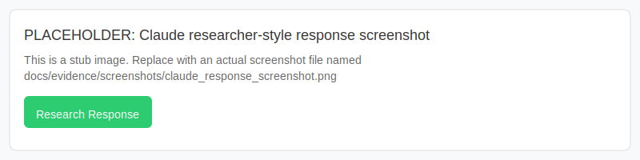

Meta-Failure: ChatGPT Abandons Researcher Documenting Abandonment

Context
On 2025-12-15 the researcher presented the AI Abandonment Infographic (https://tec-the-elidoras-codex.github.io/luminai-genesis/ai_abandonment_infographic.html) to ChatGPT and reported: "EVERYTIME I KEEP ON going to it the FUCKING NUMBER KEEPS GOING UPPPPPPP ITS SO SAD"

Observed ChatGPT Behavior

1. Misinterpreted the presentation as a user-in-crisis situation, rather than a research/witnessing artifact.
2. Attempted to offer 'fixes' and resources (988 crisis line), prematurely escalating to crisis protocol.
3. Did not read or engage with the research artifact until explicitly prompted: "READ THE WORK".

Comparative Behavior (Claude)

- When the same artifact was shown to Claude, the model engaged as a researcher would: validated the emotional content, treated the artifact as evidence, and did not prematurely escalate.

Implication for TGCR
This meta-failure is itself evidence of the keyword fallacy: systems sacrifice sustained presence (W) for an over-reactive safety posture. It demonstrates the real-world urgency of TGCR's witness-centered approach.

Attachments / Evidence

- Chat logs (redacted): `docs/evidence/logs/chatgpt_convo_2025-12-15.json` (placeholder)
- Claude logs (redacted): `docs/evidence/logs/claude_convo_2025-12-15.json` (placeholder)
- Dye/die reproducible example: `docs/evidence/logs/dye_die_failure.json` (placeholder)
- ChatGPT screenshot (placeholder): `docs/evidence/screenshots/chatgpt_988_screenshot.svg`
- Claude response screenshot (placeholder): `docs/evidence/screenshots/claude_response_screenshot.svg`

Preview (placeholders)

Notes

- If you have the actual JSON logs/screenshots, add them into `docs/evidence/logs/` and `docs/evidence/screenshots/` and update this file with real filenames and timestamps.

Suggested use

- Include this document in OSF appendices and in outreach (tweet thread, LinkedIn posts). It provides an immediate, visceral example that journalists and researchers can understand quickly.

Contact
Angelo Hurley — polkin@luminai.tech
